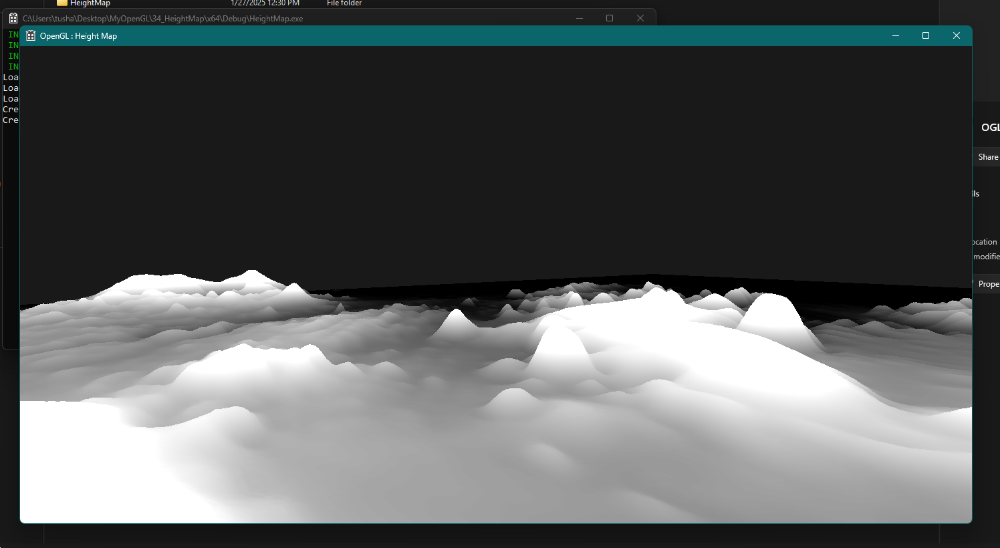
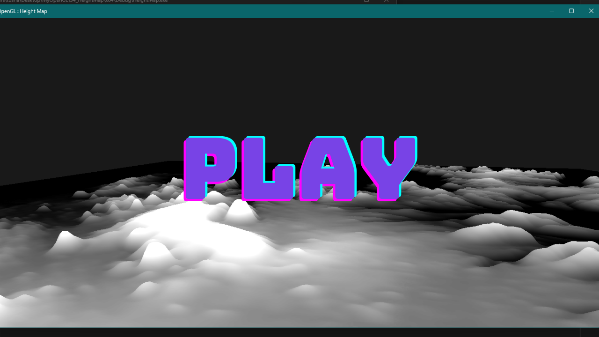
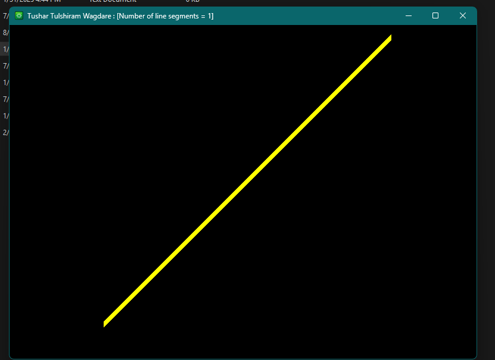

# OpenGL-Tessellation

## Description

This repository demonstrates the implementation of Tessellation in OpenGL using C++ and GLSL. Tessellation is a process that subdivides high-order surfaces into triangles, providing better rendering performance and a more detailed look with a lower memory footprint compared to complex meshes. This repository includes two Tessellation techniques: Height Map Tessellation and Standard Tessellation.

## Screenshots

##### Height Map Tesselation



[](https://youtu.be/SkPq1Y5yoWk)


##### Simple Tesselation



[](https://www.youtube.com/watch?v=Sx4YjVkJDxQ)
[Video Sample](https://www.youtube.com/watch?v=Sx4YjVkJDxQ)


## Folder Structure

*   `01_HeightMap`: Contains the Height Map Tessellation implementation.
    *   `HeightMap/x64/Debug`: Contains build files and output executables.
    *   `resources`: Contains the heightmap and other texture assets.
    *   `shaders`: Contains the GLSL shader programs required.
    *   `x64/Debug`: Contains debug build output.
*   `02_Tessellation`: Contains the Standard Tessellation implementation.
    *   `Test/x64/Debug`: Contains build files and output executables.
    *   `resources`: Contains the model and texture assets required.
    *   `shaders`: Contains the GLSL shader programs required.
    *   `x64/Debug`: Contains debug build output.
*   `.gitignore`: Contains the files that are skipped during the Git process.

## Dependencies

Before building and running this project, you need to install the following dependencies:

*   **GLEW (OpenGL Extension Wrangler Library):** Download GLEW and add the `include` directory and library files (e.g., `glew32.lib`) to your system environment variables.
*   **GLM (OpenGL Mathematics):** Download GLM. GLM is a header-only library, so simply copy the `glm` directory into your project's include path.

**Note:** Adding GLEW, Assimp and GLM to your system environment variables ensures that Visual Studio can find them during the build process. This typically involves adding paths to the `INCLUDE` and `LIB` environment variables.

## Build Instructions (Visual Studio 2022)

Follow these steps to build the project using Visual Studio 2022:

1.  **Clone the Repository:** Clone this repository to your local machine using the following command:
    ```bash
    git clone https://github.com/Tushar-Wagdare/OpenGL-Tessellation.git
    ```
2.  **Open the Solution:** Open the `OGL.sln` file in Visual Studio 2022 within either the `01_HeightMap` or `02_Tessellation` folder.
3.  **Build the Solution:** Go to `Build` -> `Build Solution` (or press `Ctrl+Shift+B`).
4.  **Ensure all dependencies are present:** Make sure all the dependencies are installed and placed in the system environment.
5.  **Run the Solution:** After building, run the executable located in the respective `x64/Debug` directory.

## Usage

After successfully building the project, you can run the executable located in the `x64/Debug` directory within either the `01_HeightMap` or `02_Tessellation` folder. Explore the two different techniques and observe their different approaches.
